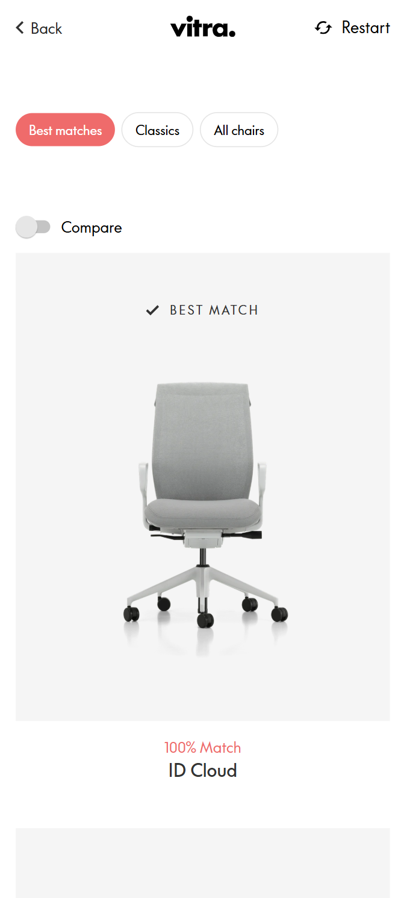

# Procesverslag
[Markdown cheat cheet](https://github.com/adam-p/markdown-here/wiki/Markdown-Cheatsheet).

## Jij

  
uitwerken voor kick-off werkgroep

  Auteur: **Bence Barens**

  Je startniveau: **Zwarte piste**

  Je focus: **Surface**
 

## Je website

  
uitwerken voor kick-off werkgroep

  ### Je opdracht:
  [Vitra Office Chair Finder](https://findmy.vitra.com/)

  #### Screenshot(s) van de eerste pagina (small screen): 
  Find my | Vitra 
  
  

  #### Screenshot(s) van de tweede pagina (small screen):
  Results | Vitra 
  
  
  
 

## Toegankelijkheidstest 1/2 (week 1)

  
uitwerken na test in 2e werkgroep

  ### Bevindingen
  Het grootste probleem met de huidige website, is dat er geen enkele semantiek in zit. Er is een eindeloze nesteling van div-elementen en geen van de inputs hebben input-tags. Ook is er geen enkele mogelijkheid om bij de navigatie te komen zonder eerst langs elke stoel te tabben, voor elke pagina. Tot slot is aan de vormgeving van de input vaak niet duidelijk wat voor input kan worden gegeven. Zo staan er sliders bij binaire keuzes en checkboxes waar maar één mogelijkheid is.

  Ik zou de website kunnen verbeteren door een "skip to main" link te kunnen maken en door de HTML 'correcter' op de bouwen. Ook zou het zowel makkelijker als beter zijn om alle quiz-pagina's op dezelfde pagina te zetten. Zo is alle content alvast ingeladen, is navigatie minder ingewikkeld en kan ik animaties zonder ingewikkelde javascript laten werken. Verder ga ik alle inputs een unieke vormgeving geven voor meer affordance.

## Breakdownschets (week 1)

  
uitwerken na afloop 3e werkgroep

  #### Eerste pagina
  
  

  #### Tweede pagina
  
  

## Voortgang 1 (week 2)

  
uitwerken voor 1e voortgang

  ### Stand van zaken
  hier dit ging goed & dit was lastig (neem ook screenshots op van delen van je website en code)

  ### Agenda voor meeting
  samen met je groepje opstellen

  | student 1      | student 2          | student 3    | student 4        |
  | ---            | ---                | ---          | ---              |
  | dit bespreken  | en dit             | en ik dit    | en dan ik dat    |
  | en dat ook nog | dit als er tijd is | nog een punt | dit wil ik zeker |
  | ...            | ...                | ...          | ...              |

  ### Verslag van meeting
  hier na afloop snel de uitkomsten van de meeting vastleggen

  - Code ziet er goed uit (behalve beetje inline JS)
  - Initiele website-screenshots moeten nog naar klein scherm
  - Toegankelijkheidstest verder aanvullen

## Voortgang 2 (week 3)

  
uitwerken voor 2e voortgang

  ### Stand van zaken
  hier dit ging goed & dit was lastig (neem ook screenshots op van delen van je website en code)

  ### Agenda voor meeting
  samen met je groepje opstellen

  | student 1      | student 2          | student 3    | student 4        |
  | ---            | ---                | ---          | ---              |
  | dit bespreken  | en dit             | en ik dit    | en dan ik dat    |
  | en dat ook nog | dit als er tijd is | nog een punt | dit wil ik zeker |
  | ...            | ...                | ...          | ...              |

  ### Verslag van meeting
  hier na afloop snel de uitkomsten van de meeting vastleggen

  - kijken of tabindex gefixt kan worden
  - een lijstje maken van welke surface plane onderwerpen ik definitief toepas
  - prio op detailpagina

  Surface plane onderwerpen worden:
  - Prefers-reduced-motion ✅
  - Custom themes (prefers-color-scheme)❌
  - Animaties ✅
  - SVG (icons) stylen en animeren ❌
  - Meer complete micro-interacties ✅
  - Wat omvangrijkere formulieren met styling ✅
  - DOM manipulatie ✅
  - BlingBling ✅

## Toegankelijkheidstest 2/2 (week 4)

  
uitwerken na test in 9e werkgroep

  ### Bevindingen
  Lijst met je bevindingen die in de test naar voren kwamen (geef ook aan wat er verbeterd is):

## Voortgang 3 (week 4)

  
uitwerken voor 3e voortgang

  ### Stand van zaken
  hier dit ging goed & dit was lastig (neem ook screenshots op van delen van je website en code)

  ### Agenda voor meeting
  samen met je groepje opstellen

  | student 1      | student 2          | student 3    | student 4        |
  | ---            | ---                | ---          | ---              |
  | dit bespreken  | en dit             | en ik dit    | en dan ik dat    |
  | en dat ook nog | dit als er tijd is | nog een punt | dit wil ik zeker |
  | ...            | ...                | ...          | ...              |

  ### Verslag van meeting
  hier na afloop snel de uitkomsten van de meeting vastleggen

  - punt 1
  - punt 2
  - nog een punt
  - ...

## Eindgesprek (week 5)

  
uitwerken voor eindgesprek

  ### Je uitkomst - karakteristiek screenshots:
  

  ### Dit ging goed/Heb ik geleerd: 
  Korte omschrijving met plaatjes

  

  ### Dit was lastig/Is niet gelukt:
  Korte omschrijving met plaatjes

  

## Bronnenlijst

  
continu bijhouden terwijl je werkt

  Nb. Wees specifiek ('css-tricks' als bron is bijv. niet specifiek genoeg). 
  Nb. ChatGpT en andere AI horen er ook bij.
  Nb. Vermeld de bronnen ook in je code.

  1. bron 1
  2. bron 2
  3. ...

